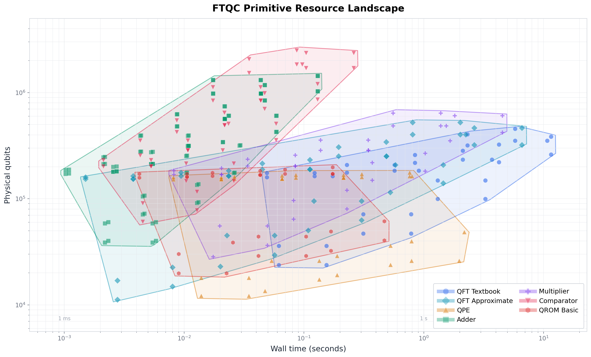

# qrepro

Fault-tolerant quantum computing (FTQC) primitives benchmark suite. Builds canonical FTQC building blocks on [Qualtran](https://qualtran.readthedocs.io/) + [Cirq](https://quantumai.google/cirq), extracts logical and surface-code physical resource costs, verifies correctness by small-scale simulation, and exports programs to [QREF](https://github.com/PsiQ/qref) for symbolic cost propagation in [Bartiq](https://github.com/PsiQ/bartiq). Published resource estimates from Beverland et al., Gidney–Ekera 2019 and Gidney 2025 are reproduced against pinned dependency versions and asserted in the test suite.

<p align="center">
  
</p>

<p align="center">
  <em>Physical resource landscape: qubits × time footprint per primitive variant as problem size scales, over all 12 surface-code configurations (2 QEC profiles × 3 data blocks × 2 magic-state factories). Layout after <a href="https://arxiv.org/abs/2211.07629">Beverland et al.</a></em>
</p>

## Installation

Requires Python 3.10–3.12 and [uv](https://docs.astral.sh/uv/).

```bash
git clone https://github.com/m2papierz/qrepro.git && cd qrepro
make install      # uv sync
make setup        # additionally installs pre-commit hooks
```

## Usage

All commands go through `uv run qrepro` (or bare `qrepro` inside an activated venv).

### Run a benchmark

```bash
uv run qrepro run qft -p n=32                          # logical costs only
uv run qrepro run qft -p n=32 --physical               # + surface-code physical estimate
uv run qrepro run qft -p n=32 --physical --breakdown   # + per-component cost attribution
uv run qrepro run arithmetic -p n=64 -p op=mul
uv run qrepro run qrom -p data_size=256 -p variant=selectswap -p log_block_sizes=4
```

`--out results/qft.json` saves the result as JSON.

### Physical model variants

```bash
uv run qrepro run qft -p n=32 --physical \
  --profile beverland --data-block fast --factory fifteen_to_one
uv run qrepro run qft -p n=32 --physical --data-d 21             # fixed code distance
uv run qrepro run qft -p n=32 --physical --error-budget 1e-2     # custom error budget
```

Profiles: `gidney_fowler` (default), `beverland`. Data blocks: `simple` (default), `compact`, `fast`. Factories: `ccz2t` (default), `fifteen_to_one`.

### Verify, export, compile

```bash
uv run qrepro verify qft -p n=4 -p variant=textbook          # small-scale simulation
uv run qrepro export-qref qft -p n=32 --out qft.yaml         # numeric QREF (authoritative)
uv run qrepro export-qref qft -p n=32 --symbolic --check --out qft_sym.yaml
uv run qrepro bartiq qft_sym.yaml --assign n=64
```

> [!IMPORTANT]
> `--symbolic` exports approximate analytic formulas that capture dominant scaling only and may diverge from the numeric benchmark. `--check` reports the divergence. Numeric export is authoritative.

### Configuration

```bash
uv run qrepro dump-config                       # print defaults
uv run qrepro dump-config --out config.yaml     # save, edit, then:
uv run qrepro run qft -p n=32 --config config.yaml
```

Key options: `rotation_synthesis_epsilon` (default `1e-10`), `error_budget` (default `1e-3`), `physical_error`, `cycle_time_us`, `data_d`. Each has a per-run CLI override (`--rotation-eps`, `--error-budget`, `--physical-error`, `--cycle-time-us`, `--data-d`).

### Make targets

```bash
make run-all      # full pipeline: benchmarks, verification, QREF export, sweeps, reproductions
make test         # integration and reference-reproduction tests
make verify       # small-scale Cirq simulation checks
make sweeps       # assumption sweeps + resource landscape => CSV + PNG
make fmt          # ruff import-sort + format
```

`make run-all` calls `run_all.sh`, which writes to `results/`: `runs/` (benchmark JSON), `qref/numeric/` and `qref/symbolic/`, `sweeps/` (CSV), `charts/` (PNG), `configs/`.

## Primitives

| Primitive | Variants | Key metric |
|-----------|----------|------------|
| QFT | Textbook, Approximate | T-count vs n (incl. rotation synthesis) |
| QPE | Textbook (pluggable U) | T-count vs precision bits |
| Arithmetic | Add, OutOfPlaceAdder, LessThanEqual, Product, ModAdd | T-count vs bitsize |
| QROM | QROM, SelectSwapQROM | T-count vs table size |

Modular exponentiation (reference and windowed) lives in `algorithms/factoring.py` and `algorithms/windowed_factoring.py`. It is not a CLI primitive; it is driven by the reproductions below.

## Layout

```
src/qrepro/
├── algorithms/      # primitive benchmarks + the Benchmark protocol and registry
├── references/      # published-estimate reproductions; values.py holds every paper constant
├── resource.py      # logical-cost extraction from Qualtran's QECGatesCost
├── breakdown.py     # per-component cost attribution over the call graph
├── physical.py      # surface-code physical estimation
├── export.py        # QREF v1 export, numeric and symbolic
└── cli.py           # click command group
experiments/         # parameter sweeps and the landscape chart
notebooks/           # reproduction and pipeline notebooks
tests/               # integration and reference tests, pinned regression literals
```

## Reproductions

```bash
uv run qrepro reproduce beverland
uv run qrepro reproduce ge19                   # --skip-windowed to omit the window sweep
uv run qrepro reproduce decomposition          # --convention per_run|expected|both
```

Measured against `qualtran==0.7.0`:

| target | source | published | qrepro | deviation |
|---|---|---|---|---|
| Beverland quantum dynamics — `c_min` | (D3) | 1.4401e6 | 1.4401e6 | +0.00% |
| Beverland quantum chemistry — `c_min` | (D3) | 4.1e11 | 4.1176e11 | +0.43% |
| Beverland factoring — `c_min` | (D3) | 1.23e10 | 1.2270e10 | −0.24% |
| GE19 Toffoli, n=2048 | abstract formula | 2.7e9 (Table 1) | 2.624e9 | −2.9% |
| GE19 windowed CCZ, n=2048 | Table 1 | 2.7e9 | 1.635e9 | 0.605× |
| GE19 windowed CCZ, n=2048, bridged | Table 1 | 2.7e9 | 2.712e9 | 1.004× |
| GE19 1-factory qubits | Table 2 | 16 M | 17.97 M | +12.3% |
| GE19 parallel (28f) qubits | Table 2/3 | 20 M | 17.26 M | −13.7% |
| GE19 parallel (28f) runtime, per run | Table 3 | 5.1 hr | 4.567 hr | −10.5% |
| G2025 physical qubits | abstract | < 1e6 | 3.19 M | not reproducible — see below |

`notebooks/reference_reproductions.ipynb` computes every number in this table live and asserts it before printing. `notebooks/qft_pipeline.ipynb` walks the full QRE pipeline for QFT using Qualtran/QREF/Bartiq directly.

The windowed modular exponentiation (GE19 §2.3–2.5) is built from stock Qualtran components in `algorithms/windowed_factoring.py`, giving a second derivation of the 2.7e9 regime that does not go through the paper's closed forms. Bridging the one component that differs — Qualtran's Gidney AND-adder against GE19's Cuccaro adder, ×2 on ~66% of the count — moves n=2048 from 0.605× to 1.004× Table 1. Both figures are reported; the bridge is never folded into the primary count.

Sensitivity sweeps: `experiments/sweep_rotation_epsilon.py` (synthesis precision), `experiments/sweep_ge19_physical.py` (error budget × factory count), `experiments/sweep_windowed_modexp.py` (window grid and the 1/lg²n regime test).

## Output format

Logical costs report two T-count metrics:

- `t_count_direct` — raw T-gates + 4× the magic-state count (Qualtran's And, Toffoli and CSwap, via `total_t_and_ccz_count`). Accurate for pure Clifford+T circuits.
- `t_count_ftqc` — adds rotation synthesis at `T ≈ 3·log₂(1/ε)`, i.e. ~100 T per rotation at the default `rotation_synthesis_epsilon = 1e-10`. Rotation *counts* are ε-independent; T-equivalent *ratios* are not.

`--breakdown` adds per-component attribution and the dominant component, over the categories `rotations`, `qft_qpe_core`, `qrom_core`, `arithmetic_core`, `controlled_nonclifford`, `clifford_scaffolding`, `other`. Physical estimates carry `failure_prob` and `budget_satisfied`, and record the `profile`, `data_block` and `factory` used.

## Assumptions

Every published constant, free parameter, convention, tolerance and known divergence is documented in **[ASSUMPTIONS.md](ASSUMPTIONS.md)**, with the paper and line number each value comes from.

## Limitations

- **QPE verification** — `tensor_contract` / Cirq interop fails for `TextbookQPE` (Qualtran limitation). Costs and breakdown are correct; only small-scale unitary verification skips.
- **Symbolic export** — analytic formulas are textbook-level approximations; numeric export is authoritative.
- **No retry model** — the physical layer emits a per-run duration only.
- **No yoked codes or magic-state cultivation** — G2025's sub-million estimate is not representable in a CCZ2T model, so it is decomposed rather than reproduced.
- **Logical qubits for factoring are analytic, not traced** — `QubitCount` is O(gates) and does not terminate at n=2048.
- **The coset representation is not simulated** — the windowed construction's correctness is asserted at toy sizes on the exact `ModAdd` variant, not on the padded configuration the reported counts are built from. All correctness checks are permutation-level and cannot detect a relative-phase error.

## License

MIT — see [LICENSE](LICENSE).
